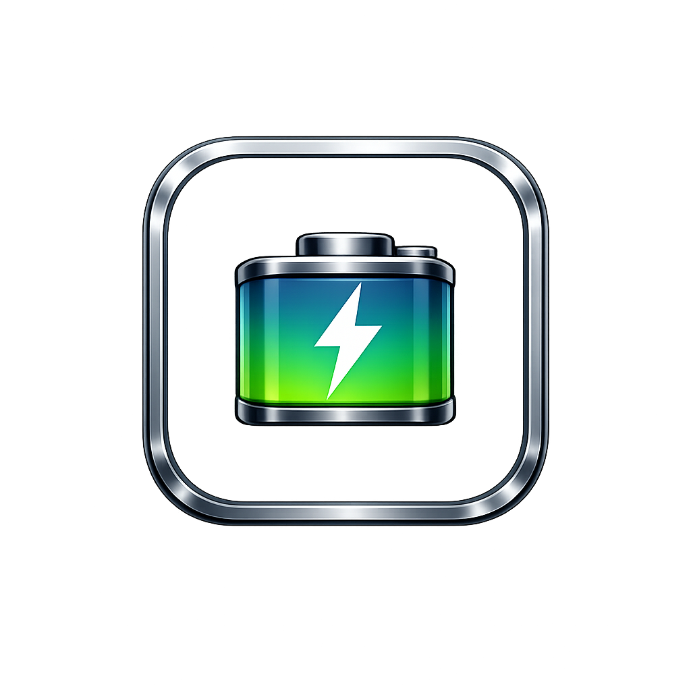
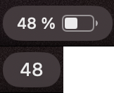
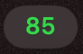
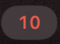
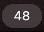

  

# MacCompactBattery

MacCompactBattery is a small macOS menu bar app that shows the current internal battery percentage as a compact numeric status item.

## Features

- Displays the current internal battery percentage in the menu bar.
- Uses a monospaced numeric label for stable width.
- Shows charging state in green.
- Shows low battery state in red below 20%.
- Registers as a login item so it starts automatically after sign-in.

## Before and After

The updated menu bar item keeps the same height while reducing its width, so the battery percentage takes less space in the menu bar.

## Status Examples

The menu bar item changes color to make battery state easier to read at a glance:

| Status | Preview | Explanation |
| --- | --- | --- |
| Charging |  | The percentage is shown in green while the Mac is connected to power and actively charging. |
| Low battery |  | The percentage switches to red when the battery level drops below 20%. |
| Normal |  | The percentage is shown in the default light color during regular battery use. |

## Requirements

- macOS 13.0 or later
- Xcode 16 or later

## Build and Run

1. Open `MacCompactBattery.xcodeproj` in Xcode.
2. Select the `MacCompactBattery` scheme.
3. Build and run the app.

The app runs as a menu bar extra and does not open a standard app window.

## How It Works

- `BatteryMonitor.swift` reads the internal battery state through `IOKit.ps`.
- `MacCompactBatteryApp.swift` creates the menu bar item, updates its attributed title, and registers the app as a login item.

## Project Notes

- The repository excludes local Xcode user state and build artifacts.
- No personal machine paths are required for building or running the app.

## License

Released under the [MIT License](LICENSE).
